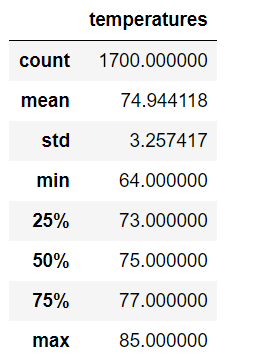
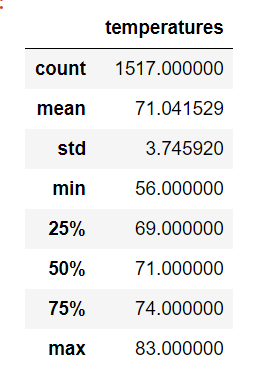

# Surfs_Up
## Project Overview
A Data Analyst is suppose to analyze the weather data using the using the SQLite  and do the following
1.	Generate the percipitation summary.
2.	Generate the weather Station analysis. 
3.	Build a climate app using the Flask.
## Resources
- Data Source: hawaii.sqlite
- Software: SQLite, SQLAlchemy Flask and Jupyter Notebook
 
## Challenge Overview
The challenge's objective is to use the available data for the month of June and December.
1. Determine the key statistical data for the month of June using all weather stations.
2. Determine the key statistical data for the month of December using all weather stations.
## Challenge Summary
The jupyter notebook and sqlite file was used to determine the statistical data for the temperatures for the month of June and December.
## Statistical Data for June and analysis:
June has a maximum temperature 85°F and 64°F with a mean temperature of 74.9°F. The days are hot and pleasant temperature during the night.The weather is a warm and humid in the month of June . 
 
 
## Statistical Data for December and analysis:
December has a maximum temperature 83°F and 56°F with a mean temperature of 71°F.The days are warm and chilling temperature during the night.The weather is a rainy in the month of December.

 ## Recommendations for further analysis:
 1. The water will be very calm and clear during the month of June so other activities like snorkeling and scuba diving will create interest in the tourist and surfers. The snorkeling and scuba equipments can be a part of inventory.
 2. The evenngs in June will be pleasant so the star watching in the cloudless skies on the beach after sunset will be welcomed by the tourists. The equipment such as chair can be made available on the rental basis.
 3. The wet season in December will be welcomed for the advanced surfers as the water will have high wave . Sturdy surf borads will be welcomed for this month .
 4. The tourist in this season will be coming to avoid snow and cold weather. The activities like hiking and play time on the beach will be welcomed .Light jacket or raincoat can be made avalible for the crowd .
